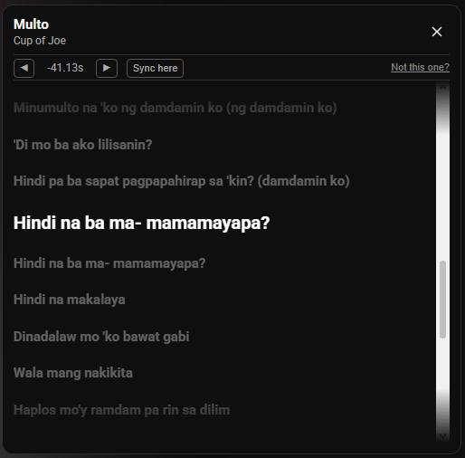

# Live Karaoke Lyrics Youtube Extension

Turn any YouTube music video into a karaoke screen. A lyrics panel appears next to the video and highlights the current line as the song plays — no searching, no setup.

## Preview

## Features

- **Automatic lyrics** for whatever you're watching — the song is detected and matched for you.
- **Line-by-line highlighting** that follows along in real time with the video.
- **Auto-scrolling lyrics** even when precise timing isn't available, so you're never stuck scrolling manually.
- **Click any line to jump** the video straight to that moment.
- **Sync adjustment** — nudge the timing or tap "sync here" if the lyrics drift out of step.
- **Fix a wrong match** by searching and picking the right song yourself — it's remembered next time.
- **Remembers your preferences** per video, so corrections and timing adjustments stick.

## Install (no build tools needed)

1. Download `youtube-karaoke-lyrics-v1.0.0.zip` from the [Releases page](../../releases) and unzip it.
2. In Chrome, go to `chrome://extensions`.
3. Turn on **Developer mode** (top-right toggle).
4. Click **Load unpacked** and select the unzipped folder.
5. Open a YouTube music video — the lyrics panel appears automatically.

To update later, download the newer release zip, remove the old unpacked extension, and load the new folder the same way.
